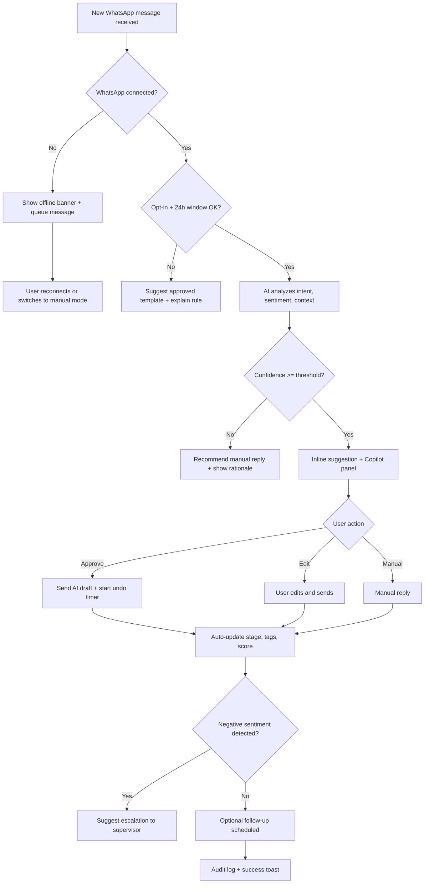
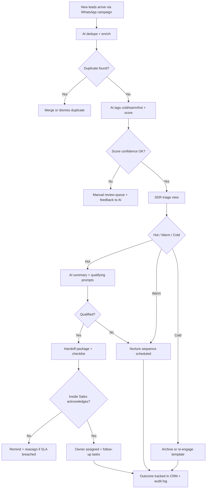

# UX Design Specification falamais-ai

**Author:** Macos
**Date:** 2026-01-01

---

<!-- UX design content will be appended sequentially through collaborative workflow steps -->
## Executive Summary

### Project Vision
falamais-ai is a multi-tenant SaaS that unifies real-time WhatsApp inbox, CRM, and automation with an agentic AI copilot. The UX must enable non-technical teams to respond faster, qualify leads, and automate follow-ups with confidence and transparency.

### Target Users
- Front-desk/operations staff in clinics, schools, and construction companies
- SDRs handling qualification and handoff to Inside Sales (B2C/B2B)
- Small business owners managing WhatsApp conversations directly
- Managers/Admins who govern AI actions, permissions, and performance

### Key Design Challenges
- Building trust in AI actions without overwhelming users
- Reducing cognitive load in a real-time, multi-conversation environment
- Making automation and CRM feel simple for non-technical users
- Ensuring fast, reliable workflows in a desktop-first context (≈70% desktop)
- Balancing autonomy vs. approval for AI actions across roles

### Design Opportunities
- Guided onboarding with industry templates and safe defaults
- Contextual AI suggestions embedded directly in conversation flow
- Role-based views that simplify decisions for each user type
- A unified canvas that connects inbox, CRM stages, and automations
- Clear auditability and visibility into AI decisions to increase trust

## Core User Experience

### Defining Experience
The core experience is real-time conversation handling in WhatsApp with AI assistance: users review messages, accept or edit AI suggestions, and move leads through the funnel with minimal friction. The product's value loop is: message arrives -> AI suggests -> user acts -> CRM updates -> outcome tracked.

### Platform Strategy
- Desktop-first web app (≈70% usage) optimized for mouse/keyboard workflows and multi-panel layouts.
- Responsive mobile experience (≈30%) focused on quick triage, fast replies, and approvals.
- Real-time UX with persistent presence indicators and connection health status.
- Office environment usage with shortcuts and dense information layouts for speed.

### Effortless Interactions
- Approve/edit AI suggestions directly in the conversation flow.
- Access lead history, tags, and funnel stage without context switching.
- One-click follow-ups and stage updates from inbox.
- Quick filters and search across conversations and leads.
- Templates and automation starters ready at onboarding.

### Critical Success Moments
- First AI-assisted reply that moves a lead forward and updates CRM.
- First automated follow-up that recovers a silent lead.
- First handoff to Inside Sales with complete context in one action.
- Onboarding success: WhatsApp connected and first automation activated.

### Experience Principles
- Speed with clarity: fast actions without losing context.
- AI as a co-pilot: transparent suggestions with human control.
- Context always visible: no hidden lead or conversation data.
- Progress at a glance: funnel status and outcomes are instantly legible.
- Safe autonomy: approvals and auditability by default.

## Desired Emotional Response

### Primary Emotional Goals
- Confidence and control over AI-assisted actions
- Clarity and calm during real-time conversations

### Emotional Journey Mapping
- Discovery: curiosity and trust
- Onboarding: guided, safe, and in control
- Daily use: focused, efficient, and supported by a co-pilot
- Success moments: relief and pride
- Failures or uncertainty: safety, predictability, and clear recovery

### Micro-Emotions
- Confidence over confusion
- Trust over skepticism
- Relief over anxiety
- Empowerment over helplessness
- Transparency over opacity

### Design Implications
- Always show why the AI suggested an action
- Keep human approval as the default and clearly visible
- Provide undo/rollback and audit trails for AI actions
- Make automation status and scope explicit
- Use progressive autonomy (increase AI autonomy only after trust is earned)
- Provide clear, consistent system feedback and error recovery

### Emotional Design Principles
- User-in-control autonomy
- Transparent AI decisions
- Calm, focused workspace
- Predictable actions and outcomes
- Celebrate wins with subtle confirmation

## UX Pattern Analysis & Inspiration

### Inspiring Products Analysis
- Chatwoot: Strong real-time inbox with clear status, assignment, and conversation context. Multi-panel layout supports speed and visibility.
- Slack: Excellent information hierarchy, fast navigation, keyboard-first workflows, and clear unread states.
- Blip: Robust flow/automation builder with guided configuration and scalable node-based patterns.
- Clint: CRM-centric view of leads and stages, emphasizing pipeline clarity and quick updates.

### Transferable UX Patterns
- Three-panel inbox layout (Chatwoot): conversation list, thread, and lead context side-by-side.
- Persistent status + unread signals (Slack): clear attention management in high-volume flows.
- Keyboard shortcuts + quick switcher (Slack): speed in a desktop-first environment.
- Node-based automation canvas (Blip): visual flow building with safe defaults.
- Pipeline visibility + quick stage moves (Clint): clear sales progress and fast updates.

### Anti-Patterns to Avoid
- Generic "AI app" UI with templated icons, layouts, and cliche assistant elements.
- Overloaded screens without visual hierarchy.
- Hidden AI actions that reduce user trust.
- Overuse of chatbot visual patterns that feel impersonal.
- Complex configuration steps without guidance.

### Design Inspiration Strategy
**Adopt:**
- Chatwoot's operational clarity for inbox and context panels.
- Slack's speed, shortcuts, and attention management.
- Blip's guided automation builder for non-technical users.

**Adapt:**
- CRM pipeline patterns (Clint) into a WhatsApp-first workflow.
- Automation UX to be simpler and safer for SMB teams.

**Avoid:**
- Template-like UI and common AI iconography.
- Generic layouts that look like "every other AI tool."

## Design System Foundation

### 1.1 Design System Choice
- Design System: shadcn/ui (theme: Nova)
- Style: Nova (compact, dense layouts for data-heavy CRM)
- Primary Color: Emerald (2025 AI/innovation signal)
- CSS Variables: Yes (token-based theming and flexibility)

### Rationale for Selection
- Nova supports high-density dashboards and operational UIs without sacrificing clarity.
- Emerald conveys innovation and AI-forward positioning while avoiding generic corporate blue.
- CSS variables enable scalable theming across tenants and future brand extensions.

### Implementation Approach
- Token-first system with global CSS variables for color, spacing, typography, and elevation.
- Component primitives styled for compact density and fast scanning.
- Consistent semantic color roles (success, warning, AI suggestion, automation state).

### Customization Strategy
- Allow per-tenant theme overrides via CSS variables.
- Support light-first with optional accent variations.
- Preserve high contrast and readability in dense views.

## 2. Core User Experience

### 2.1 Defining Experience
The defining experience is: "AI is my business partner." Users receive WhatsApp messages, the AI co-pilot proposes the best response and next action, and the user approves or edits with one click while the CRM updates automatically.

### 2.2 User Mental Model
Users currently handle WhatsApp manually, often with a separate CRM or spreadsheets. Follow-ups and stage updates are manual, and context is scattered across tools. They expect a familiar inbox + pipeline model, but want guidance on what to do next.

### 2.3 Success Criteria
- Response time drops and fewer leads are missed
- The user feels they always know the next best action
- AI suggestions are accepted frequently without rework
- Funnel stages update consistently with minimal manual effort
- More conversations move to a clear outcome (won/qualified)

### 2.4 Novel UX Patterns
Use established patterns (inbox, kanban funnel, automation builder) but introduce a unique, always-present co-pilot layer:
- AI suggestions embedded in the conversation flow
- One-click approval with instant CRM updates
- Clear, transparent AI rationale and audit trail

### 2.5 Experience Mechanics
**1. Initiation:** New message arrives -> AI summarizes intent and suggests action.  
**2. Interaction:** User reviews, edits if needed, and approves with one click.  
**3. Feedback:** Lead stage updates, status changes, and automation results are shown immediately.  
**4. Completion:** A clear outcome is logged (qualified, scheduled, resolved) and the next step is suggested.

## Visual Design Foundation

### Color System
- Base (Dark): deep navy background with soft gradients
- Surface: dark slate for cards and panels
- Primary: emerald/teal for CTAs and key highlights
- Secondary/Accent: muted teal + warm orange for emphasis/illustration accents
- Semantic: success (emerald), warning (amber), error (rose), info (cyan)
- Borders: subtle, low-contrast lines for separation in dense layouts

### Typography System
- Primary typeface (UI): modern geometric sans for clarity and density
- Headings: slightly heavier weight for hierarchy
- Body: highly readable, compact line heights
- Suggested pairing: Sora (headings) + Inter (body) (adjustable to brand)
- Type scale: 12/14/16/18/24/32 with tight but readable line heights

### Spacing & Layout Foundation
- Density: compact, data-dense CRM layout
- Spacing scale: 4px base grid (4/8/12/16/20/24/32)
- Cards: medium radius, subtle shadow/glow, consistent padding
- Layout: 12-column grid, strong left-to-right scanning paths

### Accessibility Considerations
- Minimum contrast 4.5:1 for text on dark surfaces
- Clear focus states for keyboard navigation
- Touch targets >= 44px for mobile
- Avoid low-contrast teal-on-dark for body text

## Design Direction Decision

### Selected Direction
Direction A — Hybrid (A+B)

### Rationale
- Closest to WhatsApp Web mental model while keeping CRM visibility intact.
- AI suggestions appear inline for fast approvals, with a lateral copilot panel for context and control.
- Balances focus and guidance without feeling like a generic AI template.

### Implications
- Maintain three-panel layout with subtle AI surfaces in the thread and in the right panel.
- Keep interaction density high for desktop-first use, with a clear hierarchy and fast action affordances.

## User Journey Flows

### Journey 1: AI-Assisted Reply (Ana - Front-Desk Coordinator)
Goal: respond quickly with AI support, move lead stage, and keep full control.



### Journey 2: Qualification and Handoff (Lucas - SDR)
Goal: triage high-volume leads, qualify, and handoff with full context.



### Journey 3: Onboarding and First Automation (Carla - Small Business Owner)
Goal: connect WhatsApp, launch first automation, and see first win safely.

```mermaid
flowchart TD
  A[Create account] --> B[Connect WhatsApp via QR]
  B --> C{Connection success?}
  C -- No --> C1[Troubleshooting + support CTA]
  C -- Yes --> D[Choose industry template]
  D --> E[Preflight checks: opt-in, 24h rule, sender ID]
  E --> F[AI suggests copy + edits]
  F --> G{User approves?}
  G -- Edit --> H[User edits copy]
  G -- Approve --> I[Save automation draft]
  H --> I
  I --> J[Test in sandbox (no real send)]
  J --> K{Test passed?}
  K -- No --> K1[Highlight missing fields + fix]
  K -- Yes --> L[Activate with guardrails]
  L --> L1[Limit first run to small batch]
  L1 --> M[Monitor first run metrics]
  M --> N{Errors detected?}
  N -- Yes --> N1[Auto-pause + rollback + notify user]
  N -- No --> O[Success message + KPI card]
```

### Journey Patterns
- Safety-first gating: opt-in/24h checks, confidence thresholds, and sandbox testing.
- Control loops: approve/edit/ignore, undo windows, and manual overrides.
- Recovery patterns: auto-pause, rollback, SLA reassignment, and connection banners.
- Transparency: show AI rationale and write to audit logs on every action.

### Flow Optimization Principles
- Prevent damage before speed: guardrails always before automation.
- Make recovery obvious: surface fallbacks and reversal paths.
- Keep trust visible: AI reasoning and confidence shown near actions.
- Reduce overload: smart triage and SLA-based reassignment.

## Component Strategy

### Design System Components
Primary shadcn/ui components to reuse:
- Layout: Card, Separator, ScrollArea, Tabs, Sheet, Drawer
- Inputs: Input, Textarea, Select, Combobox, Checkbox, Switch
- Actions: Button, DropdownMenu, Tooltip, Popover
- Data: Table, Badge, Progress, Skeleton, Toast
- Navigation: Breadcrumb, Pagination (where needed)
- Feedback: Alert, Dialog, Toast

### Custom Components

#### Conversation List Item
**Purpose:** Represent a WhatsApp conversation preview with status and urgency.  
**Usage:** Left column list; used for active, unread, and assigned queues.  
**Anatomy:** Avatar, name, last message snippet, time, unread badge, tags, status dot.  
**States:** Default, unread, active, hover, disabled, offline.  
**Variants:** Compact (dense), Standard.  
**Accessibility:** Entire row is a focusable button; aria-label with name + status.  
**Content Guidelines:** Keep snippet to 1 line; tags max 2 visible.  
**Interaction Behavior:** Click selects conversation; keyboard up/down navigates list.

#### Message Bubble Group
**Purpose:** Display incoming/outgoing messages with timestamps and delivery state.  
**Usage:** Chat thread center panel.  
**Anatomy:** Bubble, sender marker, timestamp, delivery indicator, optional attachments.  
**States:** Incoming, outgoing, pending, failed, edited.  
**Variants:** Text, media, document, audio.  
**Accessibility:** Ensure role="article" and readable time labels.  
**Content Guidelines:** Line length <= 70 chars; show media preview.  
**Interaction Behavior:** Hover reveals actions (copy, reply, forward).

#### AI Suggestion Inline Card
**Purpose:** Inline AI draft with approve/edit/ignore actions.  
**Usage:** Inserted between bubbles in the thread.  
**Anatomy:** Label, suggestion text, confidence, actions row.  
**States:** Default, applied, rejected, low-confidence warning.  
**Variants:** Reply draft, action suggestion, follow-up suggestion.  
**Accessibility:** Buttons have clear aria-labels; focus order left to right.  
**Content Guidelines:** Keep suggestion <= 2 lines, show rationale on hover.  
**Interaction Behavior:** Approve sends draft; Edit opens composer; Ignore hides.

#### Copilot Insight Panel
**Purpose:** Persistent AI context for the active conversation.  
**Usage:** Right column, above CRM details.  
**Anatomy:** Summary, intent, next action, confidence, reason, quick actions.  
**States:** Normal, low-confidence, error (AI unavailable).  
**Variants:** Compact (agent view), Expanded (manager view).  
**Accessibility:** Section headings with landmarks; buttons keyboard accessible.  
**Content Guidelines:** Show 1 key insight + 1 next action.  
**Interaction Behavior:** Action triggers system tasks with undo window.

#### Lead Context Sidebar
**Purpose:** CRM context for the active lead.  
**Usage:** Right column below copilot.  
**Anatomy:** Profile header, pipeline stage, tags, notes, quick actions, tasks.  
**States:** Default, empty (new lead), read-only (viewer).  
**Variants:** Sales, Support, Mixed.  
**Accessibility:** Inline edit fields labeled; tags list with remove buttons.  
**Content Guidelines:** Show only high-value fields, collapse long notes.  
**Interaction Behavior:** Stage drag/drop or dropdown; tag add/remove inline.

#### Connection Status Banner
**Purpose:** Surface WhatsApp connection health and recovery.  
**Usage:** Top of left panel or global header.  
**Anatomy:** Status icon, message, CTA (reconnect), last sync time.  
**States:** Connected, reconnecting, disconnected, rate-limited.  
**Variants:** Compact (banner), Full (dialog).  
**Accessibility:** Role="status" with live region for changes.  
**Content Guidelines:** Short, actionable message.  
**Interaction Behavior:** CTA opens QR flow or troubleshooting.

### Component Implementation Strategy
- Build all custom components using shadcn tokens and Nova density rules.
- Prefer composition over custom primitives (e.g., Card + Badge + Button).
- Keep AI components in a dedicated namespace for auditability and reuse.
- Add list virtualization for conversation list and message thread.
- Standardize spacing with 4px grid and consistent min heights.

### Implementation Roadmap
**Phase 1 - Core Components:**
- Conversation List Item (critical inbox flow)
- Message Bubble Group (core chat flow)
- AI Suggestion Inline Card (core AI action flow)
- Lead Context Sidebar (CRM visibility)
- Connection Status Banner (resilience and trust)

**Phase 2 - Supporting Components:**
- Copilot Insight Panel (enhanced guidance)
- Tag Editor + Stage Selector (CRM efficiency)
- Undo Toast + Audit Log Row (control and trust)

**Phase 3 - Enhancement Components:**
- Handoff Package Drawer (SDR to Inside Sales)
- Bulk Action Toolbar (high-volume ops)
- Template Picker + Quick Replies (speed)

## UX Consistency Patterns

### Button Hierarchy
**When to Use:** Define priority of actions in inbox, AI suggestions, and CRM updates.  
**Visual Design:** Primary = emerald fill; Secondary = outline; Tertiary = text only. Destructive = red outline.  
**Behavior:** Primary actions always right-aligned in action groups; destructive actions require confirm/undo.  
**Accessibility:** Buttons labeled with verbs; keyboard focus ring visible.  
**Mobile Considerations:** Primary CTA pinned to bottom when possible.  
**Variants:** Primary, Secondary, Tertiary, Destructive, Ghost.

### Feedback Patterns
**When to Use:** Any AI action, message send, automation change, or connection state.  
**Visual Design:** Toast for quick confirmations, inline banners for persistent issues, inline hints in chat.  
**Behavior:** Success toasts auto-dismiss; error banners persist until resolved; AI actions show undo timer.  
**Accessibility:** Use role="status" for live updates; color + icon + text.  
**Mobile Considerations:** Toasts appear above composer to avoid occlusion.  
**Variants:** Success, Warning, Error, Info, Offline.

### Form Patterns
**When to Use:** Lead edits, tags, pipeline changes, automation settings.  
**Visual Design:** Inline fields with subtle borders, compact spacing, helper text under inputs.  
**Behavior:** Validate on blur; show inline errors; autosave for single-field edits.  
**Accessibility:** Labels always visible; errors connected via aria-describedby.  
**Mobile Considerations:** Avoid multi-column forms; use bottom sheets for complex forms.  
**Variants:** Inline edit, Modal form, Wizard (onboarding).

### Navigation Patterns
**When to Use:** Primary app navigation and intra-inbox actions.  
**Visual Design:** Top navigation for modules; left panel for conversation list; right panel for context.  
**Behavior:** Keep conversation context sticky; switching conversations preserves scroll position.  
**Accessibility:** Keyboard shortcuts for jump to search and next/previous conversation.  
**Mobile Considerations:** Left list collapses into tab; right panel becomes drawer.  
**Variants:** Standard view, Compact view, Manager view.

### Additional Patterns
**AI Suggestion Pattern:** Always show rationale + confidence; actions are Approve / Edit / Ignore with undo.  
**Search & Filters:** Global search bar with scoped filters (status, tags, assignee).  
**Empty States:** Provide 1–2 actions (connect WhatsApp, import leads).  
**Loading:** Skeletons for list + thread; show "AI thinking" placeholder.  
**Connection Status:** Persistent banner with reconnect CTA; last sync timestamp.  
**Audit Trail:** Every AI action logs who/what/when; accessible from context panel.
